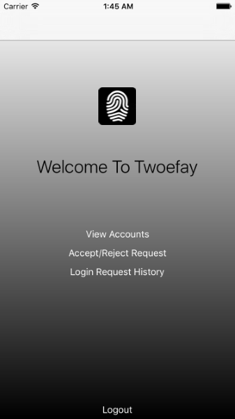

Twoefay iOS Client
======
Twoefay is an open-source platform for easy two factor authentication using iOS TouchID. This repository contains the iOS client which receives push notifications from the Twoefay server.

#### Screenshot

## Getting Started

### Installation

Open Twoefay.xcworkspace in Xcode 7.3 and compile it.

## Contributors

### Contributors on GitHub
* [Anthony Nguyen](https://github.com/resolutedreamer)
* [Chris Orcutt](https://github.com/orcudy)
* [Jon Woong](https://github.com/jonwoong/)

### Third party libraries
*  [Alamofire](https://github.com/Alamofire/Alamofire)
*  [OneTimePassword](https://github.com/mattrubin/OneTimePassword)
*  [QRCodeReader.swift](https://github.com/yannickl/QRCodeReader.swift)
*  [RealmSwift](https://realm.io/docs/swift/latest/)

## License 
* This project is licensed under the GNU GENERAL PUBLIC LICENSE - see the [LICENSE](https://github.com/resolutedreamer/ios-client/blob/master/LICENSE) file for details

## Version 
* Version 0.1

## Contact
#### Anthony Nguyen
* Homepage: www.resolutedreamer.com

Last Updated 2016-05-29
